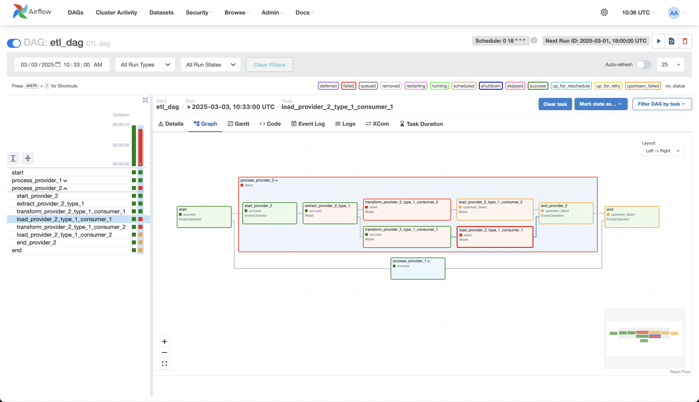

# Task 2

I created Makefile to run Airflow

1. `make init`
2. `make up`
3. And `make clean` when you finish

Also I added "artificial failures" to test the dag. Result looks like this:

First time DAG finished successfully, but second time two tasks within one task group failed independently.
